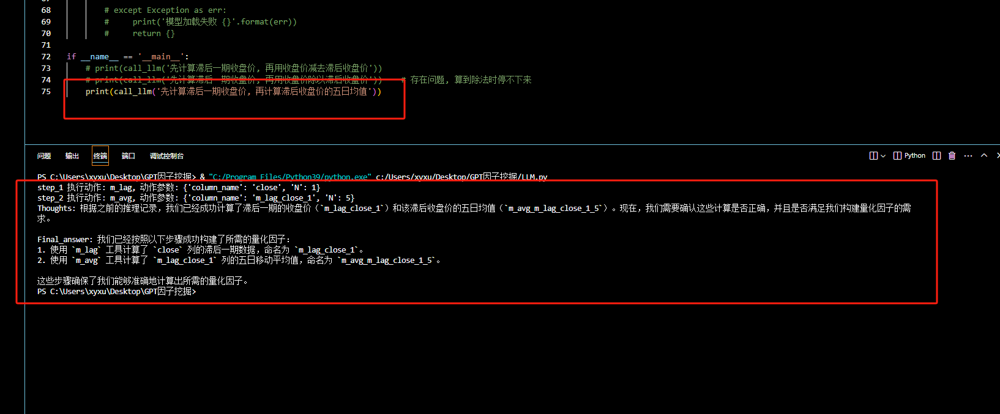
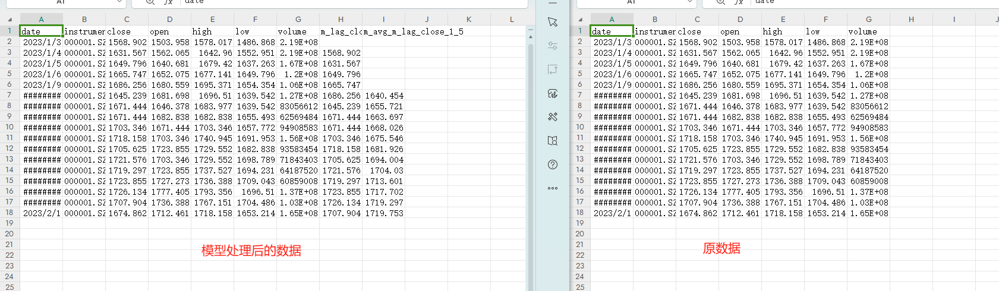

# 从强化学习开始讲起
智能体会结合当前状态$s_t$进行思考(也就是通过动作网络)然后做出决策$a_t$, 最终获得收益$r_{t+1}$, 进而进入到下一个状态$s_{t+1}$.
$$s_t\overset{a_t\, r_{t+1}}{\xrightarrow{}\xrightarrow{}}s_{t+1}\overset{a_{t+1}\, r_{t+2}}{\xrightarrow{}\xrightarrow{}}s_{t+2} ...  $$

# 过渡到我们的语言模型
其实已知$s_t$做出$a_t$这一动作是需要有一个神经网络来训练的. 现在给你一个现成的语言模型就说明这个神经网络是训练好了的. 每有一个观测状态$s_t$, 语言模型一定有办法给出一个未来奖励$r_t+r_{t+1}+...$最大化的一个动作(至少模型是这么认为的). 所以利用这一个特性, 就出现了react提示词工程. 
$$s_t\overset{a_t}{\xrightarrow{}\xrightarrow{}}s_{t+1}\overset{a_{t+1}}{\xrightarrow{}\xrightarrow{}}s_{t+2} ...  $$

# 大模型的三个角色
system: 大模型的大脑(你可以在这里定义它的人格, 如"你是一个优秀的基金经理"); 

assitant: 大模型大脑的一把手(通常用来回答用户的问题的角色); 

user: 就是我们(通常用来提出问题的). 

这个项目中我们只用到了system和user两个角色, 我们把我们的prompt工程用在了system角色上. 

# react提示词工程
## 基于react提示词工程制作agent
1. 定义任务, 并且给大语言模型提供工具; 
2. 输入你的任务$s_0$, 他会基于他自己的一套"神经网络算法"匹配出最佳的工具$a_0$, 既然模型能得到$a_0$, 那么就有一定的道理, 这个道理我们同样可以输出$reasonging_0$(这一步就是这个神经网络的具象化的想法); 
3. 我们从外部调用这个工具$a_0$会获得一个结果和推理过程$reasoning_0$, 我们将这个结果和之前语言模型做出的动作以及停留的状态进行拼接得到$s_1$(这一步是设计agent的关键); 
4. 这个agent交互点就在第三点, 智能体会反复执行第三点, 知道出现最终答案, 他会停止输出. 

## 只观感受以下这个提示词工程
### system的输入: 

"""""""""""""""""""""""""""""""""""""""""""""""""""""""""""""""""""""""""""""""""""""""""""""""""""""""""""""""""""""""""""""""""""""""""""""""""""""""""""""""""""""""""""""""""""""

你是一个优秀的***, 现在我给你提供工具[......], 你将使用这些工具来解决我的问题, 帮助我挖掘出我想要的因子. 

我需要的因子表述如下: [.........]

你必须以以下格式来回答问题: 

=======================================================================================================

thoughts(reasoning): 思考你需要做什么才能靠近目标(注意是靠近, 毕竟这个提示词是为了引导大模型一步一步逼近目标的); 

action: 从我给你的工具中挑选一个, 并返回名称; 

action_input: 需要在这个函数当中传入什么样的参数; 

observation: 工具运行的结果

=======================================================================================================

有如下限制: 

1. 你无法执行动作, 所以observation必须要求用户来给你提供
2. ...................................

=======================================================================================================

下面是之前的聊天记录, 希望能为你提供接下来的决策上的帮助

[...................]

"""""""""""""""""""""""""""""""""""""""""""""""""""""""""""""""""""""""""""""""""""""""""""""""""""""""""""""""""""""""""""""""""""""""""""""""""""""""""""""""""""""""""""""""""""""

# 用法
1. 你需要将你的数据集设置成如data.csv格式的数据, 并替换掉它; 

2. 直接运行LLM.py即可, 调用call_llm函数描述你需要构建的因子; 

# 运行结果展示
运行LLM.py文件的结果

运行滞后会产生output.csv文件

